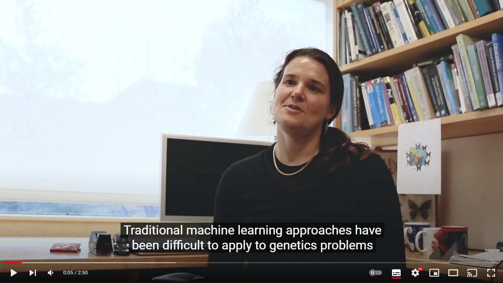
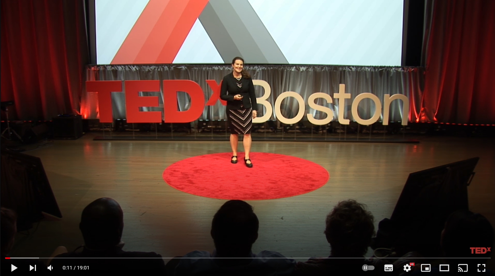

# Barbara E. Engelhardt

Barbara E. Engelhardt es una computóloga estadounidense y especialista en bioinformática. Como profesora en la Universidad de Princeton, su trabajo se ha centrado en modelos de variables latentes, análisis exploratorio dedatos genómicos y QTL. En 2021, recibió el Premio Overton de la Sociedad Internacional de Biología Computacional.

## Antecedentes académicos y profesionales
Engelhardt recibió una licenciatura en sistemas simbólicos y una maestría en ciencias de la computación de la Universidad de Stanford. Recibió un doctorado en 2008 de la Universidad de California, Berkeley, bajo la supervisión de Michael I. Jordan **(1)**. Trabajó como investigadora postdoctoral en la Universidad de Chicago en el Departamento de Genética Humana con Matthew Stephens de 2008 a 2011 **(2, 3)**. Se incorporó a la Universidad de Duke en 2011 como profesora asistente en el Departamento de Bioestadística y Bioinformática. Se mudó a la Universidad de Princeton como profesora asistente en 2014 y recibió una promoción a profesora asociada con titularidad en 2017 **(6)**. A partir de 2021, ostenta el rango de profesora **(4)**.

Engelhardt formó parte de la Junta Directiva (2014-2017) y del Consejo Asesor Senior (2017-presente) para Mujeres en el Aprendizaje Automático **(27)**. Es Copresidenta de Diversidad e Inclusión en la Conferencia Internacional sobre Aprendizaje Automático (ICML, 2018-2022) **(28)**. En 2019, fue miembro del Comité Asesor del NIH para el Director, Grupo de Trabajo sobre Inteligencia Artificial **(29)**.

## Principales aportaciones
 - Trabajó en la planificación y programación de naves espaciales autónomas para el grupo de Inteligencia artificial del Laboratorio de Propulsión a Chorro de la NASA **(5)**.

 -  Desarrolló modelos estadísticos para la anotación de funciones de proteínas y marcos estadísticos para el razonamiento sobre ontologías **(6, 7)**.

 - Desarrolló modelos de análisis factorial disperso para el estudio de la estructura poblacional  **(8)** y modelos bayesianos para pruebas de asociación **(9)**.

 - Con sus colaboradores, desarrolló modelos de variables latentes y metodologías para el análisis exploratorio de datos genómicos **(10)**, y también modelos estadísticos para pruebas de asociación de la expresión del locus del rasgo cuantitativo (QTL) **(11)**.

 - Con sus colaboradores del consorcio Genotype Tissue Expression (GTEx), descubrió el mecanismo trans-eQTL y analizó los datos de GTEx v6  **(12)** y v8 **(13)**.

 - La investigación de Engelhardt en estos modelos de variables latentes se ha expandido para incluir la secuenciación de una sola célula, con un enfoque particular en la transcriptómica espacial **(14)**.

### Barbara Engelhardt on How to Improve Statistical Analyses of Genomes - Quanta Magazine

## Honores y premios
La investigación de Engelhardt ha sido financiada por los Institutos Nacionales de Salud a través de dos subvenciones R01 y varios otros mecanismos. Engelhardt ha sido reconocido con varios premios, incluyendo una beca Alfred P. Sloan en Biología Computacional,  **(19)** un premio CAREER de la National Science Foundation, **(20)** dos becas de la Iniciativa Chan Zuckerberg para Human Cell Atlas, **(21)** y una Fast Grant para su trabajo reciente sobre Covid-19 **(22)**. En 2021, recibió el Premio Overton de la Sociedad Internacional de Biología Computacional **(23)**.

El trabajo postdoctoral de Engelhardt fue financiado en parte a través de una subvención NIH NHGRI K99, **(24)** y su doctorado fue financiado en parte a través de una beca de investigación para graduados de la NSF y la beca Google Anita Borg en 2005 **(25)**. Recibió el premio Walter M. Fitch de SMBE en 2004 **(26)**.

El trabajo de Engelhardt ha aparecido en Quanta Magazine. En 2017, dio una charla TEDx titulada: 'No qué, sino por qué: aprendizaje automático para comprender la genómica' **(18)**.

### Not What but Why: Machine Learning for Understanding Genomics -TEDxBoston

## Referencias

1.  ["Michael I. Jordan's Home Page"](https://people.eecs.berkeley.edu/~jordan/).  _people.eecs.berkeley.edu_. Recuperado  2021-01-11.

2.  ["Stephens Lab"](https://stephenslab.uchicago.edu/people.html).  _stephenslab.uchicago.edu_. Recuperado  2021-01-11.

3.  ["Eleven Women Faculty Members Who Have Been Assigned New Duties"](https://www.wiareport.com/2018/03/eleven-women-faculty-members-assigned-new-duties/).  _Women In Academia Report_. 2018-03-08. Recuperado  2021-01-11.

4.  ["Barbara Engelhardt"](https://www.cs.princeton.edu/people/profile/bee).  _Computer Science Department at Princeton_. Recuperado  2021-08-16.

5.  ["3cs | AIG"](https://sensorwebs.jpl.nasa.gov/public/projects/3cs/).  _sensorwebs.jpl.nasa.gov_. Recuperado  2021-01-11.

6.  Engelhardt, Barbara E.; Jordan, Michael I.; Muratore, Kathryn E.; Brenner, Steven E. (2005-10-07).  ["Protein Molecular Function Prediction by Bayesian Phylogenomics"](https://www.ncbi.nlm.nih.gov/pmc/articles/PMC1246806).  _PLOS Computational Biology_.  **1**  (5): e45. (https://ui.adsabs.harvard.edu/abs/2005PLSCB...1...45E).  [doi](https://en.wikipedia.org/wiki/Doi_(identifier) "Doi (identifier)"):[10.1371/journal.pcbi.0010045](https://doi.org/10.1371%2Fjournal.pcbi.0010045).  [ISSN](https://en.wikipedia.org/wiki/ISSN_(identifier) "ISSN (identifier)") [1553-7358](https://www.worldcat.org/issn/1553-7358).  [PMC](https://en.wikipedia.org/wiki/PMC_(identifier) "PMC (identifier)") [1246806](https://www.ncbi.nlm.nih.gov/pmc/articles/PMC1246806).  [PMID](https://en.wikipedia.org/wiki/PMID_(identifier) "PMID (identifier)") [16217548](https://pubmed.ncbi.nlm.nih.gov/16217548).

7.  Engelhardt, Barbara E.; Jordan, Michael I.; Srouji, John R.; Brenner, Steven E. (2011-11-01).  ["Genome-scale phylogenetic function annotation of large and diverse protein families"](http://genome.cshlp.org/content/21/11/1969).  _Genome Research_.  **21**  (11): 1969–1980.  [doi](https://en.wikipedia.org/wiki/Doi_(identifier) "Doi (identifier)"):[10.1101/gr.104687.109](https://doi.org/10.1101%2Fgr.104687.109).  [ISSN](https://en.wikipedia.org/wiki/ISSN_(identifier) "ISSN (identifier)") [1088-9051](https://www.worldcat.org/issn/1088-9051).  [PMC](https://en.wikipedia.org/wiki/PMC_(identifier) "PMC (identifier)") [3205580](https://www.ncbi.nlm.nih.gov/pmc/articles/PMC3205580).  [PMID](https://en.wikipedia.org/wiki/PMID_(identifier) "PMID (identifier)") [21784873](https://pubmed.ncbi.nlm.nih.gov/21784873).

8.  Engelhardt, Barbara E.; Stephens, Matthew (2010-09-16).  ["Analysis of Population Structure: A Unifying Framework and Novel Methods Based on Sparse Factor Analysis"](https://www.ncbi.nlm.nih.gov/pmc/articles/PMC2940725).  _PLOS Genetics_.  **6**  (9): e1001117.  [doi](https://en.wikipedia.org/wiki/Doi_(identifier) "Doi (identifier)"):[10.1371/journal.pgen.1001117](https://doi.org/10.1371%2Fjournal.pgen.1001117).  [ISSN](https://en.wikipedia.org/wiki/ISSN_(identifier) "ISSN (identifier)") [1553-7404](https://www.worldcat.org/issn/1553-7404).  [PMC](https://en.wikipedia.org/wiki/PMC_(identifier) "PMC (identifier)") [2940725](https://www.ncbi.nlm.nih.gov/pmc/articles/PMC2940725).  [PMID](https://en.wikipedia.org/wiki/PMID_(identifier) "PMID (identifier)") [20862358](https://pubmed.ncbi.nlm.nih.gov/20862358).

9.  Mangravite, Lara M.; Engelhardt, Barbara E.; Medina, Marisa W.; Smith, Joshua D.; Brown, Christopher D.; Chasman, Daniel I.; Mecham, Brigham H.; Howie, Bryan; Shim, Heejung; Naidoo, Devesh; Feng, QiPing (October 2013).  ["A statin-dependent QTL for GATM expression is associated with statin-induced myopathy"](https://www.ncbi.nlm.nih.gov/pmc/articles/PMC3933266).  _Nature_.  **502**  (7471): 377–380.  [Bibcode](https://en.wikipedia.org/wiki/Bibcode_(identifier) "Bibcode (identifier)"):[2013Natur.502..377M](https://ui.adsabs.harvard.edu/abs/2013Natur.502..377M).  [doi](https://en.wikipedia.org/wiki/Doi_(identifier) "Doi (identifier)"):[10.1038/nature12508](https://doi.org/10.1038%2Fnature12508).  [ISSN](https://en.wikipedia.org/wiki/ISSN_(identifier) "ISSN (identifier)") [1476-4687](https://www.worldcat.org/issn/1476-4687).  [PMC](https://en.wikipedia.org/wiki/PMC_(identifier) "PMC (identifier)") [3933266](https://www.ncbi.nlm.nih.gov/pmc/articles/PMC3933266).  [PMID](https://en.wikipedia.org/wiki/PMID_(identifier) "PMID (identifier)") [23995691](https://pubmed.ncbi.nlm.nih.gov/23995691).

11.  Gao, Chuan; McDowell, Ian C.; Zhao, Shiwen; Brown, Christopher D.; Engelhardt, Barbara E. (2016-07-28). Zhou, Xianghong Jasmine (ed.).  ["Context Specific and Differential Gene Co-expression Networks via Bayesian Biclustering"](https://www.ncbi.nlm.nih.gov/pmc/articles/PMC4965098).  _PLOS Computational Biology_.  **12**  (7): e1004791.  [Bibcode](https://en.wikipedia.org/wiki/Bibcode_(identifier) "Bibcode (identifier)"):[2016PLSCB..12E4791G](https://ui.adsabs.harvard.edu/abs/2016PLSCB..12E4791G).  [doi](https://en.wikipedia.org/wiki/Doi_(identifier) "Doi (identifier)"):[10.1371/journal.pcbi.1004791](https://doi.org/10.1371%2Fjournal.pcbi.1004791).  [ISSN](https://en.wikipedia.org/wiki/ISSN_(identifier) "ISSN (identifier)") [1553-7358](https://www.worldcat.org/issn/1553-7358).  [PMC](https://en.wikipedia.org/wiki/PMC_(identifier) "PMC (identifier)") [4965098](https://www.ncbi.nlm.nih.gov/pmc/articles/PMC4965098).  [PMID](https://en.wikipedia.org/wiki/PMID_(identifier) "PMID (identifier)") [27467526](https://pubmed.ncbi.nlm.nih.gov/27467526).
12.  Dumitrascu, Bianca; Darnell, Gregory; Ayroles, Julien; Engelhardt, Barbara E (2019-01-15). Hancock, John (ed.).  ["Statistical tests for detecting variance effects in quantitative trait studies"](https://academic.oup.com/bioinformatics/article/35/2/200/5050024).  _Bioinformatics_.  **35**  (2): 200–210.  [doi](https://en.wikipedia.org/wiki/Doi_(identifier) "Doi (identifier)"):[10.1093/bioinformatics/bty565](https://doi.org/10.1093%2Fbioinformatics%2Fbty565).  [ISSN](https://en.wikipedia.org/wiki/ISSN_(identifier) "ISSN (identifier)") [1367-4803](https://www.worldcat.org/issn/1367-4803).  [PMC](https://en.wikipedia.org/wiki/PMC_(identifier) "PMC (identifier)") [6330007](https://www.ncbi.nlm.nih.gov/pmc/articles/PMC6330007).  [PMID](https://en.wikipedia.org/wiki/PMID_(identifier) "PMID (identifier)") [29982387](https://pubmed.ncbi.nlm.nih.gov/29982387).
13.  Aguet, François; Brown, Andrew A.; Castel, Stephane E.; Davis, Joe R.; He, Yuan; Jo, Brian; Mohammadi, Pejman; Park, YoSon; Parsana, Princy; Segrè, Ayellet V.; Strober, Benjamin J. (October 2017).  ["Genetic effects on gene expression across human tissues"](https://www.ncbi.nlm.nih.gov/pmc/articles/PMC5776756).  _Nature_.  **550**  (7675): 204–213.  [Bibcode](https://en.wikipedia.org/wiki/Bibcode_(identifier) "Bibcode (identifier)"):[2017Natur.550..204A](https://ui.adsabs.harvard.edu/abs/2017Natur.550..204A).  [doi](https://en.wikipedia.org/wiki/Doi_(identifier) "Doi (identifier)"):[10.1038/nature24277](https://doi.org/10.1038%2Fnature24277).  [ISSN](https://en.wikipedia.org/wiki/ISSN_(identifier) "ISSN (identifier)") [1476-4687](https://www.worldcat.org/issn/1476-4687).  [PMC](https://en.wikipedia.org/wiki/PMC_(identifier) "PMC (identifier)") [5776756](https://www.ncbi.nlm.nih.gov/pmc/articles/PMC5776756).  [PMID](https://en.wikipedia.org/wiki/PMID_(identifier) "PMID (identifier)") [29022597](https://pubmed.ncbi.nlm.nih.gov/29022597).
14.  The GTEx Consortium (2020-09-11).  ["The GTEx Consortium atlas of genetic regulatory effects across human tissues"](https://www.ncbi.nlm.nih.gov/pmc/articles/PMC7737656).  _Science_.  **369**  (6509): 1318–1330.  [Bibcode](https://en.wikipedia.org/wiki/Bibcode_(identifier) "Bibcode (identifier)"):[2020Sci...369.1318.](https://ui.adsabs.harvard.edu/abs/2020Sci...369.1318.).  [doi](https://en.wikipedia.org/wiki/Doi_(identifier) "Doi (identifier)"):[10.1126/science.aaz1776](https://doi.org/10.1126%2Fscience.aaz1776).  [ISSN](https://en.wikipedia.org/wiki/ISSN_(identifier) "ISSN (identifier)") [0036-8075](https://www.worldcat.org/issn/0036-8075).  [PMC](https://en.wikipedia.org/wiki/PMC_(identifier) "PMC (identifier)") [7737656](https://www.ncbi.nlm.nih.gov/pmc/articles/PMC7737656).  [PMID](https://en.wikipedia.org/wiki/PMID_(identifier) "PMID (identifier)") [32913098](https://pubmed.ncbi.nlm.nih.gov/32913098).
15.  Verma, Archit; Engelhardt, Barbara E. (2020-07-21).  ["A robust nonlinear low-dimensional manifold for single cell RNA-seq data"](https://doi.org/10.1186/s12859-020-03625-z).  _BMC Bioinformatics_.  **21**  (1): 324.  [doi](https://en.wikipedia.org/wiki/Doi_(identifier) "Doi (identifier)"):[10.1186/s12859-020-03625-z](https://doi.org/10.1186%2Fs12859-020-03625-z).  [ISSN](https://en.wikipedia.org/wiki/ISSN_(identifier) "ISSN (identifier)") [1471-2105](https://www.worldcat.org/issn/1471-2105).  [PMC](https://en.wikipedia.org/wiki/PMC_(identifier) "PMC (identifier)") [7374962](https://www.ncbi.nlm.nih.gov/pmc/articles/PMC7374962).  [PMID](https://en.wikipedia.org/wiki/PMID_(identifier) "PMID (identifier)") [32693778](https://pubmed.ncbi.nlm.nih.gov/32693778).
16.  Camerlenghi, Federico; Dumitrascu, Bianca; Ferrari, Federico; Engelhardt, Barbara E.; Favaro, Stefano (December 2020).  ["Nonparametric Bayesian multiarmed bandits for single-cell experiment design"](https://projecteuclid.org/euclid.aoas/1608346909).  _Annals of Applied Statistics_.  **14**  (4): 2003–2019.  [arXiv](https://en.wikipedia.org/wiki/ArXiv_(identifier) "ArXiv (identifier)"):[1910.05355](https://arxiv.org/abs/1910.05355).  [doi](https://en.wikipedia.org/wiki/Doi_(identifier) "Doi (identifier)"):[10.1214/20-AOAS1370](https://doi.org/10.1214%2F20-AOAS1370).  [ISSN](https://en.wikipedia.org/wiki/ISSN_(identifier) "ISSN (identifier)") [1932-6157](https://www.worldcat.org/issn/1932-6157).  [S2CID](https://en.wikipedia.org/wiki/S2CID_(identifier) "S2CID (identifier)") [204509422](https://api.semanticscholar.org/CorpusID:204509422).
17.  Cheng, Li-Fang; Dumitrascu, Bianca; Darnell, Gregory; Chivers, Corey; Draugelis, Michael; Li, Kai; Engelhardt, Barbara E. (2020-07-08).  ["Sparse multi-output Gaussian processes for online medical time series prediction"](https://doi.org/10.1186/s12911-020-1069-4).  _BMC Medical Informatics and Decision Making_.  **20**  (1): 152.  [doi](https://en.wikipedia.org/wiki/Doi_(identifier) "Doi (identifier)"):[10.1186/s12911-020-1069-4](https://doi.org/10.1186%2Fs12911-020-1069-4).  [ISSN](https://en.wikipedia.org/wiki/ISSN_(identifier) "ISSN (identifier)") [1472-6947](https://www.worldcat.org/issn/1472-6947).  [PMC](https://en.wikipedia.org/wiki/PMC_(identifier) "PMC (identifier)") [7341595](https://www.ncbi.nlm.nih.gov/pmc/articles/PMC7341595).  [PMID](https://en.wikipedia.org/wiki/PMID_(identifier) "PMID (identifier)") [32641134](https://pubmed.ncbi.nlm.nih.gov/32641134).
18.  Cheng, Li-Fang; Prasad, Niranjani; Engelhardt, Barbara E. (2019).  ["An Optimal Policy for Patient Laboratory Tests in Intensive Care Units"](https://www.ncbi.nlm.nih.gov/pmc/articles/PMC6417830).  _Pacific Symposium on Biocomputing. Pacific Symposium on Biocomputing_.  **24**: 320–331.  [arXiv](https://en.wikipedia.org/wiki/ArXiv_(identifier) "ArXiv (identifier)"):[1808.04679](https://arxiv.org/abs/1808.04679).  [ISSN](https://en.wikipedia.org/wiki/ISSN_(identifier) "ISSN (identifier)") [2335-6936](https://www.worldcat.org/issn/2335-6936).  [PMC](https://en.wikipedia.org/wiki/PMC_(identifier) "PMC (identifier)") [6417830](https://www.ncbi.nlm.nih.gov/pmc/articles/PMC6417830).  [PMID](https://en.wikipedia.org/wiki/PMID_(identifier) "PMID (identifier)") [30864333](https://pubmed.ncbi.nlm.nih.gov/30864333).
19.  ["A Statistical Search for Genomic Truths"](https://www.quantamagazine.org/barbara-engelhardts-statistical-search-for-genomic-truths-20180227/). 27 February 2018.
20.  ["Prof. Barbara Engelhardt recipient of an Alfred P. Sloan Foundation Research Fellowship | Computer Science Department at Princeton University"](https://www.cs.princeton.edu/news/prof-barbara-engelhardt-recipient-alfred-p-sloan-foundation-research-fellowship).  _www.cs.princeton.edu_. Recuperado  2021-01-11.
21.  ["Barbara Engelhardt wins CAREER award for research with high-dimensional genomic data | Computer Science Department at Princeton University"](https://www.cs.princeton.edu/news/barbara-engelhardt-receives-nsf-career-award).  _www.cs.princeton.edu_. Recuperado  2021-01-11.
22.  ["Grants"](https://chanzuckerberg.com/grants-ventures/grants/).  _Chan Zuckerberg Initiative_. Recuperado  2021-01-11.
23.  ["Fast Grants"](https://fastgrants.org/).  _fastgrants.org_. Recuperado  2021-01-11.
24.  ["Overton Prize"](https://www.iscb.org/iscb-awards/overton-prize).  _www.iscb.org_.
25.  ["NHGRI supports seven young investigators on research career paths"](https://www.genome.gov/27545993/2012-news-feature-nhgri-supports-seven-young-investigators-on-research-career-paths).  _Genome.gov_. Recuperado  2021-01-11.
26.  ["2005 Google Anita Borg Memorial Scholarship Winners Announced – News announcements – News from Google – Google"](http://googlepress.blogspot.com/2005/04/2005-google-anita-borg-memorial_08.html).  _googlepress.blogspot.com_. Recuperado  2021-01-11.
27.  The Society for Molecular Biology & Evolution.  ["The Walter M. Fitch Award"](https://www.smbe.org/smbe/AWARDS/TheWalterMFitchAward.aspx).  _www.smbe.org_. Recuperado  2021-01-11.
28.  ["Senior Advisory Council"](https://wimlworkshop.org/senior-advisory-council/). Recuperado  2021-01-11.
29.  ["2021 Conference"](https://icml.cc/).  _icml.cc_. Recuperado  2021-01-11.

----------
2021-11-01

**Samuel Ruiz Pérez**

Genómica computacional  **-**  Grupo 7099 **-** Semestre 2022-1

Lic. en Biología

Facultad de Ciencias

Universidad Nacional Autónoma de México (UNAM)  

**Correo electrónico**:  [samuel-ruiz-perez@ciencias.unam.mx](mailto:samuel-ruiz-perez@ciencias.unam.mx)

**Telegram**: [@samuelruizperez](https://t.me/samuelruizperez)
