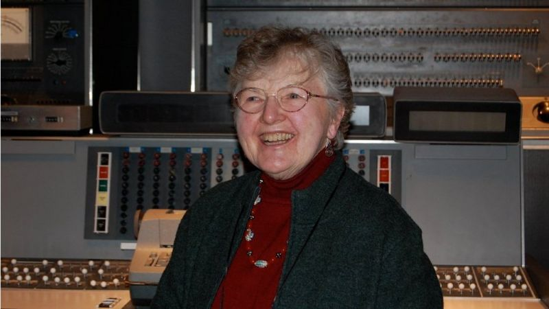

# Frances Allen
## Agosto 4, 1932 – Agosto 4, 2020

Realizó sus estudios de maestría en la universidad de Michigan, donde tomó cursos de computación. Durante ese tiempo, IBM
había ido a dicha universidad a reclutar empleados, entre los entrevistados se encontraba Frances. Había conseguido un puesto, aunque
su plan era trabajar durante un año para poder pagar sus deudas estudiantiles y poder dedicarse a enseñar.

Su plan se alargó durante 45 años más y en 1989 se convirtió en la primera mujer IBM Fellow, el más alto grado para
cualquier científico, ingeniero o programador en la empresa. Además de esto, también fue la primera mujer en recibir el premio Turing

Al entrar a la compañía, se convirtió en una experta de FORTRAN. Más aún, durante esos años los compiladores eran uno de los temas de vanguardia
en ciencias de la computación y fue en ellos donde Frances realizó grandes contribuciones. Antes desu trabajo, IBM ya había creado uno de los
compiladores más utilizados para FORTRAN, sim embargo, estos tenían muchos problemas y en el peor de los casos, se equivocaba en la traducción
que acarreaba terribles consecuencias. Ella creó gran cantidad de métodos de traducción para crear compiladores más robustos y eficientes.

Gracias a sus aportes, se ha podido impulsar y mejorar el desarrollo de los compiladores de manera que hasta personas novatas puedan
desarrollar e implementar aplicaciones y programas.

Algunas de sus contribuciones son:
* Mejoró el rendimiento de los programas de computador y aceleraron el uso de sistemas de computación de alto rendimiento (por el cual ganó el premio Turing).
* Análisis de flujo de control donde introdujo la noción de "intervalos" y relaciones de dominancia de nodos, que trae mejoras importantes sobre las abstracciones del flujo de control.
* Como enlace lingüístico con el cliente de IBM, la Agencia de Seguridad Nacional (NSA), Fran ayudó a diseñar y construir Alpha, un lenguaje de descifrado de código de muy alto nivel que presentaba la capacidad de crear nuevos alfabetos más allá de los alfabetos definidos por el sistema.

Referencias:

1. BBC News Mundo. (2021, September 26). Frances Allen, la primera mujer que ganó el Nobel de la computación (y cómo ayudó a que tengas apps ultrarrápidas). Retrieved October 26, 2021, from https://www.bbc.com/mundo/noticias-58478502
2. IBM Research Editorial Staff. (2020, September 17). Remembering Frances E. Allen. IBM Research Blog. Retrieved October 26, 2021, from https://www.ibm.com/blogs/research/2020/08/remembering-frances-allen/

### Datos Personales
K. Axel Prestegui Ramos

Semestre 2022-1. Octubre de 2022.