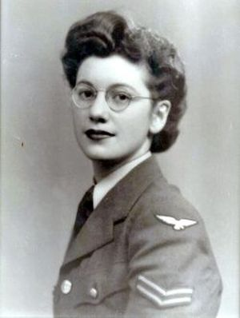

# Joan Clarke

Joan Elisabeth Lowther Murray, nacida como Joan Elisabeth Lowther Clarke (Londres, 24 de junio de 1917 – Oxford, 4 de septiembre de 1996) fue una criptoanalista y numismática británica que trabajó en Bletchley Park durante la Segunda Guerra Mundial.
- Fue la única mujer que trabajó en el equipo del matemático Alan Turing en el proyecto Enigma, que desencriptó las comunicaciones secretas de la Alemania nazi. Su papel en este proceso le valió premios y citaciones, como el nombramiento como miembro de la Orden del Imperio Británico (MBE), en 1946.
- En junio de 1940, Clarke fue reclutada por su antiguo supervisor académico, Gordon Welchman, para la Government Code and Cypher School **GCCS** Trabajó en Bletchley Park en la sección conocida como Hut 8 y rápidamente se convirtió en la única mujer practicante de 'banburismus', un proceso criptoanalítico desarrollado por Alan Turing que redujo la necesidad de bombes (dispositivos electromecánicos como los utilizados por los criptólogos británicos Welchman y Turing para descifrar mensajes encriptados alemanes durante la Segunda Guerra Mundial).
- Clarke se convirtió en subdirectora del Hut 8 en 1944, aunque se le impidió progresar debido a su género, y se le pagaba menos que a los hombres.
- Durante la década de 1980, asistió al historiador Harry Hinsley con el apéndice del volumen 3, parte 2 de la publicación British Intelligence in the Second World War. También asesoró a historiadores que estudiaban la ruptura de códigos en tiempos de guerra en Bletchley Park. Debido al secreto continuo entre los criptoanalistas, el alcance total de sus logros sigue siendo desconocido.
- En 1946, Clarke fue nombrada miembro de la Orden del Imperio Británico (MBE) por su habilidad para descifrar códigos durante la guerra.
[Referencias](https://es.wikipedia.org/wiki/Joan_Clarke)

Ana Paula Rubio Vargas, séptimo semestre, 5/11/2021