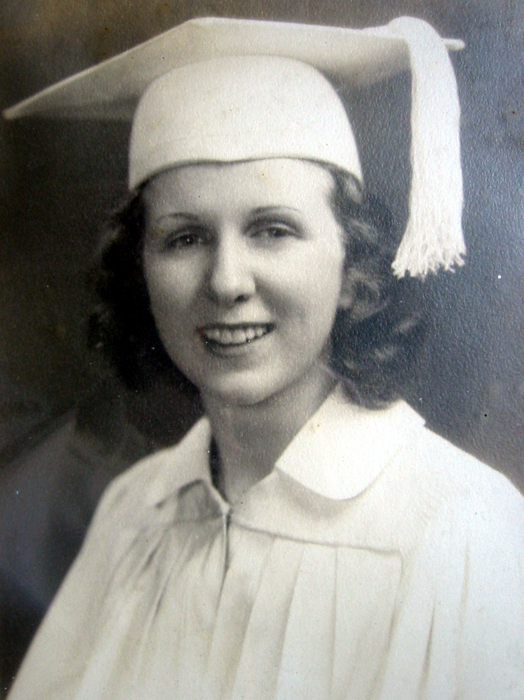
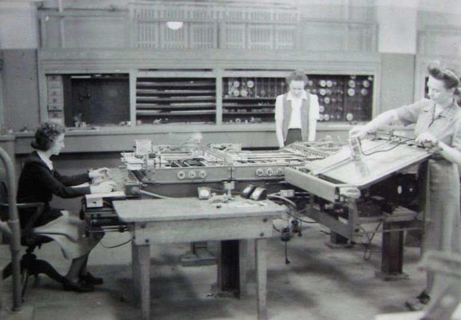

# Kathleen McNulty Mauchly Antonelli

Kathleen McNulty Mauchly Antonelli, conocida como Kathleen "Kay" McNulty, nació el 12 de febrero de 1921 en el Condado de Donegal (Irlanda).
La familia emigró a EEUU en 1924 radicándose en Pennsylvania. Kay, que cuando llegó solo hablaba gaélico, se incorporó a la escuela de Chestnut Hill y posteriormente a la Hallahan Catholic Girls High School, donde fue una de las tres mujeres de un curso de 92, que se graduó en Matemáticas en 1942.

Durante la Segunda Guerra Mundial, el Ejército de los Estados Unidos buscaba a mujeres con estudios de matemáticas para calcular a mano las trayectorias de tiro de las bombas y proyectiles. Poco después de graduarse, Kay fue seleccionada para trabajar en la escuela Moore de Ingeniería de la Universidad de Pensilvania; más de setenta jóvenes mujeres fueron empledas como "ordenadores"; el trabajo era muy tedioso, largas horas haciendo cálculos y ecuaciones diferenciales para saber la trayectoria balística. Muchas de ellas renunciaron, pero decidida y muy inteligente, Kay se convirtió en una de las más destacadas empleadas, aunque nunca dejaron de der todas ellas "simples operadoras".

Entre los años 1943-1946 John Mauchly y J. Presper Eckert construyeron el ordenador electrónico complejo que realizase las mismas funciones que las ejecutadas por el grupo de mujeres matemáticas. Así nació ENIAC (Electronic Numerical Integrator And Computer) que fue instalado en el sótano de la Escuela Moore.

Kay McNulty y Francis Bilas Spence, junto con Marilyn Wescoff Meltzer, Betty Holberton, Ruth Lichterman Teitelbaum y Jean Jennings Bartik fueron seleccionadas en 1945 para convertirse en las primeras programadoras de este sofisticado ordenador. Inicialmente tenían que elaborar toda la programación en papel y comprobarla después en el ordenador. Se trataba de resolver problemas matemáticos complejos que Kathleen McNulty y sus compañeras debían transformar en operaciones más sencillas para que el ordenador, que no tenía capacidad de almacenamiento, pudiera ejecutarlas secuencialmente. Como autodidactas, al cabo de unos meses, las mujeres programadoras consiguieron reducir a 15 segundos el tiempo de cálculo del ENIAC.

En 1947 ENIAC fue trasladado al Aberdeen Proving Ground Ballistics Research. Solo tres de las programadoras lo acompañaron: Kathleen McNulty Mauchly Antonelli, Frances Bilas Spence y Ruth Lichterman Teitelbaum.

En 1948 Kathleen McNulty se casó con John Mauchly que falleció en 1980 y, años después, ella contraería segundas nupcias con el fotógrafo Severo Antonelli.

En 1986 el Instituto Tecnológico de Letterkenny en el Condado de Donegan acuñó una medalla en honor de Kathleen McNulty, que se otorga anualmente al mejor estudiante de Informática.

Kathleen McNulty Mauchly Antonelli fue, al igual que sus otras cinco compañeras, reconocida en el Salón Internacional de la Fama de las mujeres en la tecnología en 1997. Las seis habían permanecido en el anonimato hasta que una estudiante de la Universidad de Harvard rescató del olvido su historia para un trabajo académico.

Kay McNulty falleció el 20 de abril de 2006 en Wyndmoor (Pennsylvania).

**Proyectos destacados:**
- Fue una de las seis programadoras originales de la computadora ENIAC, la primera computadora digital electrónica de propósito general.
- Kay escribió artículos sobre los pioneros de ENIAC, daba charlas y conferencias junto a su amiga Jean Jeannings Bartik, así como entrevistas a investigadores y periodistas.
- McNulty había comenzado a defender públicamente el reconocimiento de Mauchly y Presper Eckert como los co-inventores de la primera computadora electrónica de propósito general y, en 1984, fue solicitada como oradora sobre ENIAC, la historia de la computación y el papel que ella y sus colegas jugaron en el desarrollo de la informática moderna.
- En 1997, junto a sus cinco compañeras programadoras de la ENIAC –Betty Snyder Holberton, Betty Jean Jennings Bartik, Marlyn Wescoff Meltzer, Ruth Lichterman Teitelbaum y Frances Bilas Spence– fue incluida en el *Women in Technology International Hall of Fame*.
- Su historia oral fue grabada en 1998 y es parte de un documental sobre los programadores de ENlAC titulado *The Computers*.
- En honor, en el Condado de Donegal, el Instituto de Tecnología Letterkenny estableció un premio anual para el mejor estudiante de ciencias de la computación, la medalla y premio Kay McNulty.

 ### Referencias:
 1. Siglo XX - Kathleen McNulty Mauchly Antonelli. (2016, 15 marzo). Mujeres que hacen historia - Breves Biografías. Recuperado 5 de noviembre de 2021, de https://mujeresquehacenlahistoria.blogspot.com/2016/03/siglo-xx-kathleen-mcnulty-mauchly.html
 2. S. (2017, 15 noviembre). Ireland’s Greatest Woman Inventor finalist - Kay McNulty Mauchly Antonelli, first woman computer programmer - Innovation | siliconrepublic.com - Ireland’s Technology News Service. Silicon Republic. Recuperado 5 de noviembre de 2021, de https://www.siliconrepublic.com/innovation/irelands-greatest-woman-inventor-finalist-kay-mcnulty-mauchly-antonelli-first-woman-computer-programmer
 3. Stadler, M. M. (2017, 12 octubre). Kathleen R. McNulty (1921–2006). La primera “computer” que quedó obsoleta. Mujeres con ciencia. Recuperado 5 de noviembre de 2021, de https://mujeresconciencia.com/2017/10/12/kathleen-r-mcnulty-1921-2006-la-primera-computer-quedo-obsoleta/
 4. Stadler, M. M. (2015, 12 febrero). Kathleen McNulty Mauchly Antonelli, programadora. Mujeres con ciencia. Recuperado 5 de noviembre de 2021, de https://mujeresconciencia.com/2015/02/12/kathleen-mcnulty-mauchly-antonelli-programadora/

### Datos:
Alumno: Joanna Lizeth Sánchez Rangel
Número de cuenta: 315060982
Semestre 2022-1
05 de Noviembre de 2021

