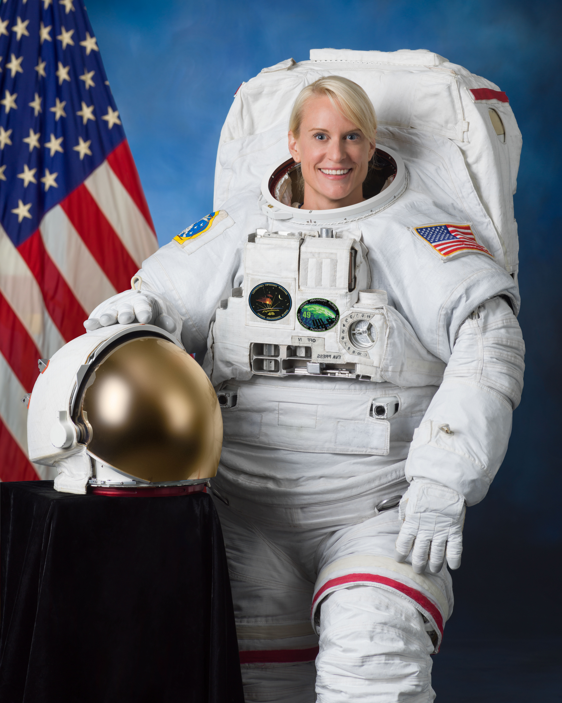
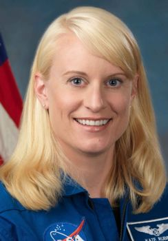

# Kathleen Rubins

   

  Kathleen Hallisey Rubins nació el 14 de octubre de 1978 en Connecticut, Estados Unidos.
  Es una astronauta estadounidense. Se convirtió en la sexagésima mujer en volar en el espacio el 6 de julio de 2016. 

  Realizó una licenciatura en biología molecular de la Universidad de California, San Diego. Está licenciada en Biología del Cáncer por el Departamento de Bioquímica de la Facultad de Medicina de la Universidad de Stanford y por el Departamento de Microbiología e Inmunología.

  Rubins realizó su investigación de pregrado sobre la integración del VIH-1 en el Laboratorio de Enfermedades Infecciosas en el Instituto Salk de Estudios Biológicos. Analizó el mecanismo de integración del VIH, incluidos varios estudios de inhibidores de la integrasa del VIH-1 y análisis genómicos de los patrones de integración del VIH en el ADN genómico del huésped. Se doctoró por la Universidad de Stanford, y con el Instituto de Investigación de Enfermedades Infecciosas del Ejército de Estados Unidos y los Centros para el Control y la Prevención de Enfermedades. 

  Ella y sus compañeros desarrollaron el primer modelo de infección de la viruela. También desarrolló un mapa completo del transcriptoma de poxvirus y estudió las interacciones virus-huésped usando sistemas modelo in-vitro y animal.

  Además, Kathleen fue la primera persona en secuenciar el ADN en el espacio. A bordo del ISS utilizó un secuenciador de ADN de mano, alimentado por USB llamado MinION fabricado por Oxford Nanopore Technologies para determinar las secuencias de ADN de un ratón.

   

## Referencias:

  1. Rainey, K. (2017, 6 agosto). First DNA Sequencing in Space a Game Changer. NASA. https://www.nasa.gov/mission_pages/station/research/news/dna_sequencing/
  2. Pearlman, R. Z. (2016, 6 julio). Station-Bound NASA Astronaut is the 60th Woman to Fly into Space. Space.Com. https://www.space.com/33355-kate-rubins-60th-woman-in-space.html

### Soto Contreras Tania, 2021-2, 18 de agosto del 2021