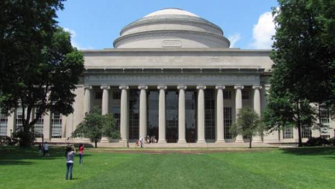

# Katherine Louise Bouman

Katie Bouman aka Katherine L. Bouman es una profesora de informatica en Caltech de 29 años que lideró la creación de un algoritmo que permitió a los científicos capturar por primera vez imágenes de un agujero negro.

# Estudios 

Katie estudio la secundaria en West Lafayette, Indiana  la cual es su ciudad natal, estudió ingeniería eléctrica en la Universidad de Míchigan y se graduó cum laude.​ (cum laude: Se usa como calificación máxima de tesis doctorales y de premios). 

Obtuvo una maestría en ingeniería eléctrica en el Instituto de Tecnología de Massachusetts (MIT), donde también completó su doctorado.

 

Bouman fue miembro del MIT Haystack Observatory y fue apoyada por una beca de posgrado de la Fundación Nacional de Ciencias.

Su tesis de maestría Estimating Material Properties of Fabric through the observation of Motion fue galardonada con el Premio Ernst Guillemin a la mejor tesis de maestría.

Ingresó en la Universidad de Harvard como becaria postdoctoral en el equipo Event Horizon Telescope Imaging.

# Contribuciones 

 

El día 10 de abril del 2019, gracias a los esfuerzos conjuntos de científicos en todo el mundo, la humanidad fue testigo de la primera imagen real de un agujero negro, un verdadero hito en la historia de la ciencia y la humanidad.

 Katie lidero el desarrollo de el algoritmo para generar imagenes de agujeros negros o mejor conocido como "Continuous High-resolution Image Reconstruction using Patch priors (CHIRP)" y fue miembro de el "Event Horizon Telescope team" el cual capturo la primera imagen de un agujero negro.
 
 El algoritmo permiria unir datos recopilados a través de la red EHT y así garantizar una imagen fidedigna, sin ningún tipo de fallo técnico o casualidad y segun cita el MIT, Bouman adoptó una solución algebraica inteligente para este problema: si las mediciones de tres telescopios se multiplican, los retrasos adicionales causados ​​por el ruido atmosférico se anulan entre sí.
 
  Esto significa que cada nueva medición requiere datos de tres telescopios, no solo dos, sino que el aumento en la precisión compensa la pérdida de información.

.

 El algoritmo fue una gran contribucion a la ciencia ya que ayudo a entender mejor a los agujeros negros lo cual ayudo hasta a comprender teorias de relatividad general y teorias de hawking que todavia no eran comprobadas pragmaticamente hasta que se obtuvo esa imagen. 
 

 Si estas mas intersado en saber sobre este proyecto te invito a dar click en la imagen de abajo para ver una conferencia TedTalks que dio Katie.

 
 
  Tambien recomiendo ver el documental "The edge of what we know" en netflix donde tambien sale ella y otra cientifica que coloboro en la contiuacion de el trabajo de que dejo hawking y en equipo pudieron hacer descubrimientos tras las imagenes tomadas de el agujero negro.

Dato curioso: En el 2021 el asteroide 291387 Katiebouman fue nombrado a nombre de ella.

# Referencias 

- https://en.wikipedia.org/wiki/Katie_Bouman
- Documentary "The edge of what we know"
- TedTalk https://www.youtube.com/watch?v=BIvezCVcsYs
- https://www.bbc.com/news/science-environment-47891902
- https://ingenio.edu.pe/blog/quien-es-katie-bouman

# Informacion de el alumno:
- Yonathan Berith Jaramillo Ramirez
- voy a mitades de la carrera
- Dia de elaboracion: 25 Octubre.