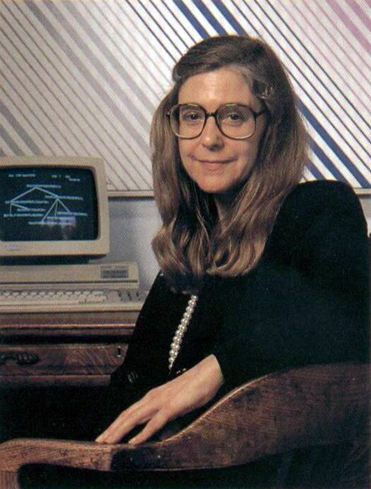
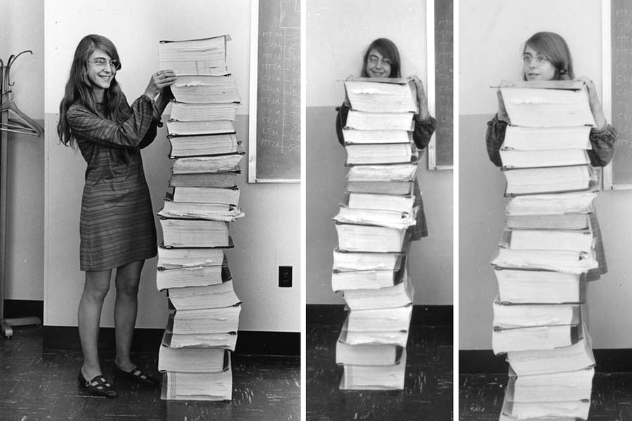

# Margaret Hamilton
---

Margaret Hamilton (17 de agosto de 1936) es una científica computacional, matemática e ingeniera de Software.

Fue directora de la División de Ingeniería de Software del Laboratorio de Instrumentación del MIT,1​ donde con su equipo desarrolló el software de navegación "on-board" para el Programa Espacial Apolo.
### **Aportaciones**
- Uno de sus mayores logros durante la dirección del desarrollo del sistema operativo para las misiones Apolo fue el sistema de excepciones y carga asincrónica de tareas que jugó un papel crucial momentos antes del alunizaje de la misión Apolo 11. Fue la encargada, junto con su equipo, de diseñar parte del software que hacía funcionar el Módulo de Mando y el Módulo Lunar, y probablemente, la persona que evitó el fracaso de la misión.
- Tras contribuir a poner a dos hombre en la Luna, durante los años venideros, Margaret dirigió y supervisó los desarrollos del resto de las misiones del programa Apollo, trabajó activamente en la creación del software de vuelo de la estación espacial Skylab, así como en los requisitos de software preliminares para la programación de vuelo del Transbordador Espacial.
- Margaret Hamilton acuñó la expresión «ingeniería del software», con la intención de que la actividad desarrollada por ella y su equipo fuera reconocida como un tipo de ingeniería y, al mismo tiempo, como una disciplina propia. En 1968 la denominación fue adoptada formalmente en la NATO Software Engineering Conference.
---

### **Referencias**
- [MIT](https://news.mit.edu/2016/scene-at-mit-margaret-hamilton-apollo-code-0817)
- [NASA](https://www.nasa.gov/feature/margaret-hamilton-apollo-software-engineer-awarded-presidential-medal-of-freedom)
---

*Daniel Villegas Aguilar*

Genómica Computacional 2021-2, Octubre 2021